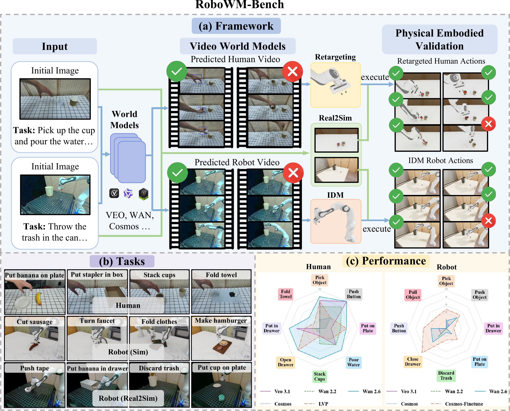

<div align="center">
  <h1><b>RoboWM-Bench</b></h1>
  <hr/>
  <h2><i>RoboWM-Bench: A Benchmark for Evaluating<br/>World Models in Robotic Manipulation</i></h2>
  <p>
    <a href="https://robowm-bench.github.io/RoboWM-Bench/">
      
    </a>
    <a href="https://arxiv.org/abs/2604.19092">
      
    </a>
    <a href="https://github.com/fffstrong/RoboWM-Bench">
      
    </a>
    <a href="https://huggingface.co/fffstrong/robowmbench-idm">
      
    </a>
  </p>
  <p>
    <a href="img/teaser.pdf">
      
    </a>
  </p>
</div>

RoboWM-Bench provides Isaac Lab simulation tasks (with a LeHome-style layout) and tooling to:
- replay robot trajectories to generate masked RGB/depth data for IDM training
- run IDM inference and convert model outputs into action JSON trajectories
- extract human hand motions using our customized Phantom algorithum
- evaluate Franka and Human tasks in simulation and optionally record cameras / per-step scores

## Table of Contents
- [Installation](#installation)
- [Project Layout](#project-layout)
- [Replay: Generate IDM Training Data](#replay-generate-idm-training-data)
- [World Model Inputs](#world-model-inputs)
- [IDM](#idm)
- [Phantom Hand Motion Extraction](#phantom-hand-motion-extraction)
- [Evaluation](#evaluation)
- [Citation](#citation)
- [Roadmap](#roadmap)

## Installation

The recommended setup is to create a clean Conda environment (Python 3.11), install a CUDA-matched PyTorch build, install this repo in editable mode, then install `lerobot` and NVIDIA IsaacSim/IsaacLab (with IsaacLab pinned to a version compatible with IsaacSim 5.1). The commands below are intended to be run on Linux with NVIDIA drivers already working (i.e., `nvidia-smi` succeeds).

```bash
# Create and activate a Conda environment
conda create -n RWMBench python=3.11
conda activate RWMBench

# Install PyTorch (CUDA 12.8 build)
pip install torch==2.7.0 torchvision==0.22.0 --index-url https://download.pytorch.org/whl/cu128

# Install RoboWM-Bench
git clone https://github.com/fffstrong/RoboWM-Bench.git
cd RoboWM-Bench
python -m pip install -e source/lehome

# Install lerobot==0.4.3
pip install "lerobot==0.4.3"
pip install "lerobot[all]==0.4.3"          # All available features

# Install IsaacSim
pip install --upgrade pip
pip install "isaacsim[all,extscache]==5.1.0" --extra-index-url https://pypi.nvidia.com

# Install IsaacLab (pinned for IsaacSim 5.1)
sudo apt install cmake build-essential
cd IsaacLab_5_1
git checkout v2.3.0
./isaaclab.sh --install

# Optional: extra utilities
pip install open3d
```
Install Phantom for human action extraction

We strongly recomand creating a new virtual environment to run the human hand pose extraction codes. Please refer to [phantom repository](https://github.com/MarionLepert/phantom) for installation.

## Project Layout

We follow the LeHome project structure. Public tasks are organized under `source/lehome/lehome/tasks/`.

Each task follows the same pattern (example: `Task00_Pick/`):
- **`Pick.py`**: environment logic (reset, randomization, observations, success criteria)
- **`Pick_cfg.py`**: Isaac Lab configuration (robot, objects, scene, cameras)
- **`__init__.py`**: Gym task registration (you can look up the task name here)

## Replay: Generate IDM Training Data

We provide a replay script that can replay trajectories in IsaacLab for different robot arms and export camera data (e.g., masked RGB and depth) for IDM training.

- **Task code reference**: `source/lehome/lehome/tasks/franka_IDM`
- **Replay script**: `sh/replay_franka.sh`

Command:

```bash
python scripts/eval/replay_franka.py \
  --task Franka-IDM \
  --json_root /your_json_root \  # The input must be a folder path that contains many JSON files and an index TXT file; each JSON is one motion trajectory (see the `replay_json` folder for an example)
  --output_root /your_output_root \
  --enable_cameras \
```

## World Model Inputs

- **Robot Tasks**: Initial RGB frames and text prompts are located in the `wm_inputs` directory.

- **Human Tasks**: Initial RGB frames and text prompts are located in `third_party/phantom/data/raw/hand_dataset`. 
  - **Video Placement**: Please place your model-generated human manipulation videos under the corresponding task and index directory: `third_party/phantom/data/raw/hand_dataset/TASK_NAME/X/`.
  - **Naming Convention**: Ensure the videos are named using the format `X_MODELNAME_rgb.mp4` (e.g., `0_veo_rgb.mp4`). Here, `X` represents the video index, and `MODELNAME` indicates the name of the World Model used for generation.

## IDM

Please refer to NVIDIA DreamGen (GR00T-dreams) for the IDM section: `https://github.com/nvidia/GR00T-dreams`.

- Replace `data_config_idm.py` with `IDM/data_config_idm.py`.
- `IDM/discard_trash` is a reference input dataset. Make sure your dataset `meta` matches the reference, especially **`modality`** and **`stats`**.
- IDM weights (open-sourced): `https://huggingface.co/fffstrong/robowmbench-idm`.

IDM inference command:

```bash
CUDA_VISIBLE_DEVICES=0,1,2,3,4,5,6,7 python IDM_dump/dump_idm_actions.py \
    --checkpoint "checkpoint_path" \
    --dataset "IDM/discard_trash" \
    --output_dir "your_output_path" \
    --num_gpus 8 \
    --video_indices "0 16"
```

## Phantom Hand Motion Extraction

### For Single Arm Task

```bash
cd third_party/phantom/phantom

python process_data.py   is_hand_dataset=true   task_name=TASK_NAME  video_patterns='*_MODELNAME_rgb.mp4'  'mode=[bbox,hand2d,action,smoothing]'   data_root_dir=../data/raw   processed_data_root_dir=../data/processed
```

- `TASK_NAME` can be one of the following:
  - `Task01_Franka_Tableware_Cube`
  - `Task02_Franka_Tableware_Banana`
  - `Task03_Franka_Tableware_Push_Button`
  - `Task04_Franka_Tableware_Banana_Plate`
  - `Task05_Franka_Tableware_Stack_Cup`
  - `Task06_Franka_Tableware_Stapler_Box`
  - `Task07_Franka_Tableware_Pour_Water`
  - `Task08_Franka_Tableware_Drawer`
  - `Task09_Franka_Tableware_Banana_Drawer`
  - `Task10_Franka_Tableware_Towel`
  - `Task11_Bi_Franka_Tableware_Cook` *(Dual Arm)*
  - `Task12_Bi_Franka_Tableware_Big_Box` *(Dual Arm)*

- `frame_idx`: Frame index to process (e.g., 0, 1, 2). Default is null, which means processing all frame indices

- `MODELNAME`: The world model to be evaluated (e.g., veo, wan_26, cosmos)

### For Dual Arm Task
```bash
cd third_party/phantom/phantom

# Mask half of a video with black pixels to isolate a single hand. 
python utils/black_impaint.py \
    --input_video "../data/raw/hand_dataset/TASK_NAME/X/X_MODELNAME_rgb.mp4" \

# Process right hand action
python process_data.py   is_hand_dataset=true   task_name=TASK_NAME  target_hand="right" video_patterns='*_MODELNAME_left_black_rgb.mp4'  'mode=[bbox,hand2d,action,smoothing]'   data_root_dir=../data/raw   processed_data_root_dir=../data/processed

# Process left hand action
python process_data.py   is_hand_dataset=true   task_name=TASK_NAME  target_hand="left" video_patterns='*_MODELNAME_right_black_rgb.mp4'  'mode=[bbox,hand2d,action,smoothing]'   data_root_dir=../data/raw   processed_data_root_dir=../data/processed
```

## Evaluation

### Robot

After IDM produces outputs, run `sh/parquet2action.sh` to convert the predicted actions into trajectory JSON files:

```bash
python tools/parquet_actions_to_json.py \
    --input_dir /your_input_dir \ # Folder path that contains parquet files
    --pose_dir ./GT/button \  # Select the GT subfolder for the current task
    --output_dir /your_output_dir
```

Then run `sh/eval_franka.sh`:

```bash
python scripts/robot/eval_franka.py \
  --task Franka-pick \  # Available tasks: Franka-pick, Franka-put_on_plate, Franka-discard_trash, Franka-put_in_drawer, Franka-press_button, Franka-close_drawer, Franka-pull_and_push
  --json_root your_json_path \  # The output folder produced by `sh/parquet2action.sh`
  --enable_cameras \
  --output_root your_output_path \ 
  --device "cpu" \ # Whether to run the simulation on CPU
  --part_scores \  # Whether to enable per-stage scoring; only Franka-put_on_plate, Franka-discard_trash, Franka-put_in_drawer have stage-score design
  # --episode_index 9  # Test a single JSON index only
  # --save_dataset  \   # Whether to save execution data
```

### Human
```bash
# For Single Arm Tasks (Add --debug to print more information)
python scripts/human/dataset_replay_npz.py \
    --task_name "Task04_Franka_Tableware_Banana_Plate" \
    --model_name "human" \
    --num_envs 1 \
    --enable_cameras \
    --device cpu

# For Dual Arm Tasks (Add --debug to print more information)
python scripts/human/dataset_replay_npz_bi.py \
    --task_name "Task11_Bi_Franka_Tableware_Cook" \
    --model_name "human" \
    --num_envs 1 \
    --enable_cameras \
    --device cpu
```

## Roadmap

- Open-source the pure-simulation tasks + evaluation code, and release the corresponding IDM weights (target: mid-May).

## Citation

If you find RoboWM-Bench useful, please cite:

```bibtex
@misc{jiang2026robowmbenchbenchmarkevaluatingworld,
      title={RoboWM-Bench: A Benchmark for Evaluating World Models in Robotic Manipulation}, 
      author={Feng Jiang and Yang Chen and Kyle Xu and Yuchen Liu and Haifeng Wang and Zhenhao Shen and Jasper Lu and Shengze Huang and Yuanfei Wang and Chen Xie and Ruihai Wu},
      year={2026},
      eprint={2604.19092},
      archivePrefix={arXiv},
      primaryClass={cs.RO},
      url={https://arxiv.org/abs/2604.19092}, 
}
```